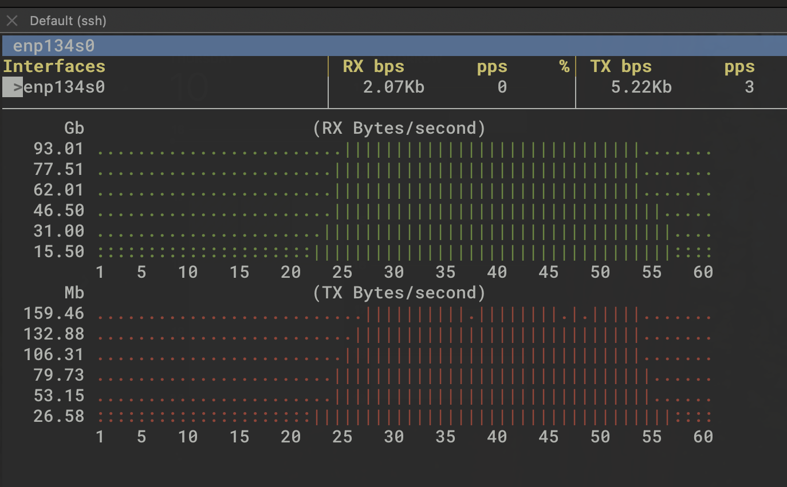

# S3 High-Performance Downloader

A tool for downloading files from S3-compatible storage with optimized multi-threaded and multi-process approaches.

## Table of Contents

- [Overview](#overview)
- [Features](#features)
- [Requirements](#requirements)
- [Installation](#installation)
- [Usage](#usage)
- [Command Line Arguments](#command-line-arguments)
- [Performance Optimization Tips](#performance-optimization-tips)
  - [Optimized Parameters for H100 (128 vCPU)](#optimized-parameters-for-h100-128-vcpu)
  - [Monitoring Network Performance](#monitoring-network-performance)
- [Output](#output)
- [Examples](#examples)
- [How It Works](#how-it-works)
- [Troubleshooting](#troubleshooting)

## Overview

This tool provides high-throughput downloads from S3-compatible object storage by leveraging:
- Multi-process file parallelism
- Multi-threaded concurrent downloads within each file
- Direct streaming to disk with optimized I/O
- Auto-optimization based on system capabilities
- Comprehensive benchmarking and validation

## Requirements

- Python 3.6+
- Required Python packages:
  - boto3
  - numpy
  - termcolor
  - psutil (optional, for better auto-optimization)
  - asyncio (optional, for improved performance)

## Installation

```bash
pip install boto3 numpy termcolor psutil
```

## Usage

### Basic Usage

```bash
python s3_downloader.py \
  --access-key-aws-id YOUR_ACCESS_KEY \
  --secret-access-key YOUR_SECRET_KEY \
  --endpoint-url https://your-s3-endpoint.com \
  --bucket-name your-bucket \
  --iteration-number 10 \
  --object-size-mb 100 \
  --concurrency 8 \
  --multipart-size-mb 25 \
  --save-to-disk ./downloads
```

### Download Files with a Specific Prefix

```bash
python s3_downloader.py \
  --access-key-aws-id YOUR_ACCESS_KEY \
  --secret-access-key YOUR_SECRET_KEY \
  --endpoint-url https://your-s3-endpoint.com \
  --bucket-name your-bucket \
  --prefix "data/" \
  --iteration-number 100 \
  --concurrency 8 \
  --multipart-size-mb 25 \
  --save-to-disk ./downloads
```

### Auto-Optimize Parameters

```bash
python s3_downloader.py \
  --access-key-aws-id YOUR_ACCESS_KEY \
  --secret-access-key YOUR_SECRET_KEY \
  --endpoint-url https://your-s3-endpoint.com \
  --bucket-name your-bucket \
  --prefix "data/" \
  --iteration-number 100 \
  --concurrency 8 \
  --multipart-size-mb 25 \
  --save-to-disk ./downloads \
  --auto-optimize
```

## Command Line Arguments

| Argument | Description | Default |
|----------|-------------|---------|
| `--access-key-aws-id` | Access Key AWS ID | (Required) |
| `--secret-access-key` | Secret Access Key | (Required) |
| `--region-name` | AWS Region Name | eu-north1 |
| `--endpoint-url` | S3 Endpoint URL | (Required) |
| `--bucket-name` | S3 Bucket Name | (Required) |
| `--iteration-number` | Number of iterations/files to download | (Required) |
| `--object-size-mb` | Object Size in MB (for test files) | (Required if no prefix) |
| `--concurrency` | Concurrency per file | (Required) |
| `--multipart-size-mb` | Multipart part Size in MB | (Required) |
| `--file-parallelism` | Number of files to download in parallel | 4 |
| `--max-pool-connections` | Max boto3 connection pool size | 100 |
| `--prefix` | Only download files with this prefix | None |
| `--save-to-disk` | Path where to save downloaded files | None |
| `--streaming-mode` | Use direct streaming to disk | True |
| `--skip-validation` | Skip post-download validation | False |
| `--io-threads` | Number of I/O threads per worker | 8 |
| `--chunk-size-kb` | Chunk size in KB for streaming | 1024 |
| `--auto-optimize` | Automatically optimize parameters for CPU | False |

## Performance Optimization Tips

1. **Tune File Parallelism**: Set `--file-parallelism` to match your system's CPU count (or slightly lower for best performance)
2. **Adjust Concurrency**: For each file, set `--concurrency` based on file size and network constraints
3. **Configure Multipart Size**: Use `--multipart-size-mb` to balance download speed with memory usage
4. **Use Streaming Mode**: Enable `--streaming-mode` for large files to avoid memory constraints
5. **Optimize I/O**: Adjust `--io-threads` and `--chunk-size-kb` based on disk performance
6. **Enable Auto-Optimization**: Use `--auto-optimize` to automatically tune parameters for your environment

### Optimized Parameters for H100 (128 vCPU)

The following parameters achieved the best performance results on H100 instances with 128 vCPUs:

```bash
python3 s3_downloader.py \
  --access-key-aws-id YOUR_ACCESS_KEY \
  --secret-access-key YOUR_SECRET_KEY \
  --endpoint-url https://storage.eu-north1.nebius.cloud:443 \
  --bucket-name your-bucket \
  --iteration-number 172 \
  --prefix tempfile_ \
  --concurrency 2 \
  --multipart-size-mb 1024 \
  --file-parallelism 96 \
  --max-pool-connections 4096 \
  --save-to-disk /mnt/ramdisk \
  --io-threads 16 \
  --chunk-size-kb 16384
```

Key observations for high-performance systems:
- Use high file parallelism (96) but lower per-file concurrency (2)
- Large multipart size (1GB) for fewer, larger chunks
- Very large connection pool (4096) for handling many parallel requests
- RAM disk for eliminating disk I/O bottlenecks
- Increased I/O threads (16) and chunk size (16MB) for optimized throughput

With these parameters, the tool achieved nearly line-rate speed, demonstrating the utility's ability to fully saturate network links on high-performance hardware. The performance graph below shows network utilization reaching approximately 93 Gb/s (11.6 GB/s) download speed, which approaches the theoretical maximum of a 100 Gb/s network interface:



*The graph shows consistent network utilization around 93 Gb/s for downloads (RX) with the optimized parameters on H100 with 128 vCPUs.*

### Monitoring Network Performance

Network utilization was measured using the `bmon` tool. To reproduce similar measurements:

1. Install bmon on Ubuntu:
   ```bash
   sudo apt-get install bmon
   ```

2. Monitor specific network interface:
   ```bash
   bmon -p 'interface_name' -r 1 -b -o format:fmt='ts = $(time=$(time) rx=$(attr:rxrate:bytes) tx=$(attr:txrate:bytes)\n'
   ```
   Replace `interface_name` with your actual network interface (e.g., eth0, ens5, etc.)

This command provides real-time monitoring with 1-second refresh intervals and outputs timestamp, RX, and TX rates in bytes.


## Output

The tool provides:
- Real-time download progress with color-coded status
- Post-download validation results
- JSON summary with detailed throughput metrics:
  - Mean, min, max, and standard deviation of throughput
  - Percentile breakdowns (p0, p5, p50, p75, p95, p100)
  - Total combined throughput
  - Execution duration

## Examples

### Running a Simple Benchmark

```bash
python s3_downloader.py \
  --access-key-aws-id YOUR_ACCESS_KEY \
  --secret-access-key YOUR_SECRET_KEY \
  --endpoint-url https://your-s3-endpoint.com \
  --bucket-name your-bucket \
  --iteration-number 5 \
  --object-size-mb 100 \
  --concurrency 8 \
  --multipart-size-mb 25 \
  --save-to-disk ./downloads
```

### Downloading Real Files with Auto-Optimization

```bash
python s3_downloader.py \
  --access-key-aws-id YOUR_ACCESS_KEY \
  --secret-access-key YOUR_SECRET_KEY \
  --endpoint-url https://your-s3-endpoint.com \
  --bucket-name your-bucket \
  --prefix "large-files/" \
  --iteration-number 20 \
  --concurrency 8 \
  --multipart-size-mb 25 \
  --file-parallelism 4 \
  --save-to-disk ./downloads \
  --auto-optimize
```

## How It Works

1. **Initialization**: Sets up optimal connection pools and client configurations
2. **Auto-Optimization** (if enabled): Analyzes system resources and file properties to determine optimal parameters
3. **File Processing**: Distributes work across multiple processes for file-level parallelism
4. **Part Processing**: Each file download is broken into parts for concurrent download
5. **I/O Optimization**: Multi-threaded I/O improves disk write performance during streaming
6. **Validation**: Verifies file integrity after download completes
7. **Metrics Collection**: Gathers and reports performance statistics

## Troubleshooting

- **Slow Downloads**: Try increasing `--concurrency` and `--file-parallelism`
- **Out of Memory**: Reduce `--file-parallelism` or enable `--streaming-mode`
- **Disk Bottlenecks**: Adjust `--io-threads` and `--chunk-size-kb`
- **Connection Errors**: Increase `--max-pool-connections` or reduce parallelism parameters
